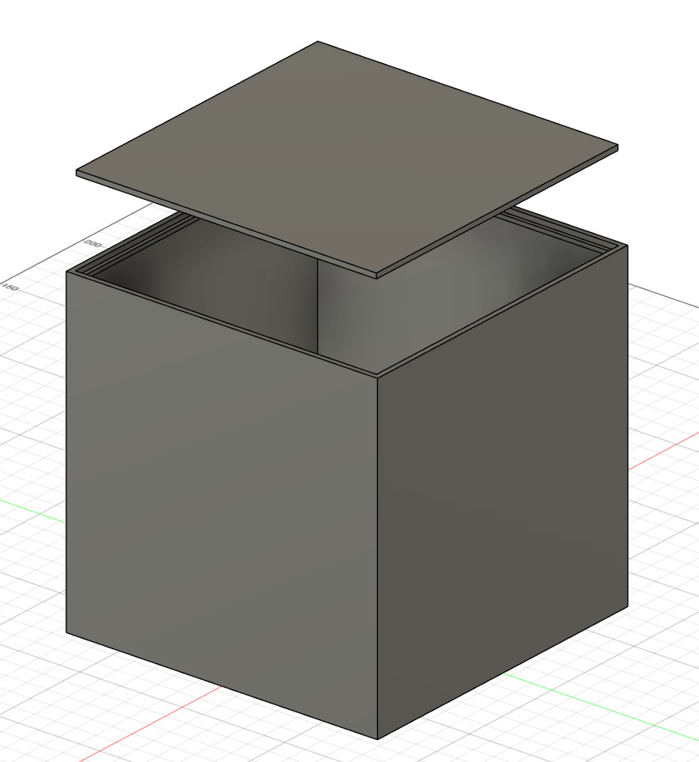
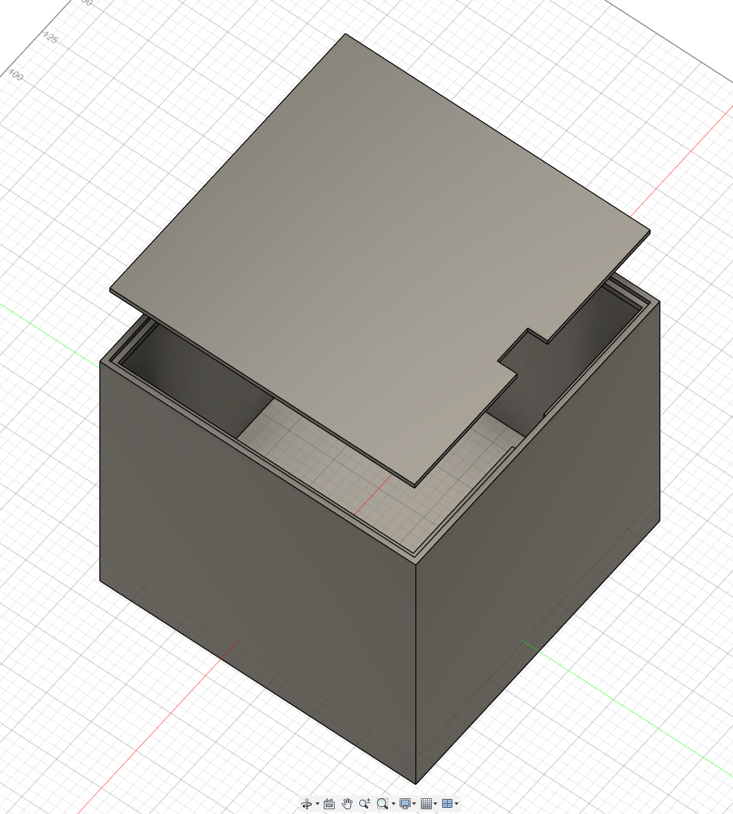
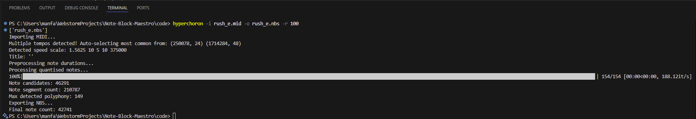

### Total time spent on project: 21 hours

## June 28th: Planning

Today was spent planning out the project just to make sure it's technically feasible, as well as doing some basic setup and preparation. As for hardware, this is what I've come up with so far (very tentative and incomplete list):

- Raspberry Pi 4 B 2GB for main processing, playback, and converting of files
- 32 GB MicroSD card for OS files, programs, and audio files
- HiFiBerry MiniAmp (3 W × 2) as the amplifier
- Some kind of speakers for audio playback
- Push buttons w/ LEDs for basic controls
- USB-C PSU to power Pi and MiniAmp
- Any wood I have lying around for the box

I also took a look into software to use for the project:

- [Hyperchoron](https://github.com/thomas-xin/hyperchoron) as the tool to convert sequence files to Minecraft-compatible formats
- [pynbs](https://github.com/OpenNBS/pynbs) and [pygame](https://github.com/pygame/pygame) to play audio from the speakers

Next I'll work on actually submitting the project, testing software from my PC, and figuring out specific hardware models to purchase as well as costs.

### Total time spent: 2 hours

## June 29th: Planning, shopping, and finalizing

The past day has mostly been spent just planning and shopping for parts. I think I have figured out every part that I want to use:

- Raspberry Pi 5 4GB for all processing
- 64 GB MicroSD card for storage
- USB MicroSD reader for my PC
- MAX98357 I²S mono amp (3 W) for speaker output
- Dayton PC105-4 4" speaker for good audio playback; should hit >90dB
- 2.8″ SPI Arducam TFT with 5 MP camera and 320x240 display. It seems like an odd choice, but it has a really great deal right now, and the camera and touchscreen open up lots of future possibilities
- 10x 12-mm push buttons
- 2x KY‑040 encoders
- Dupont jumper wire bundle
- 600‑pc M3 nylon standoffs in case I don't have any lying around
- Premium soldering kit in case I don't have one somewhere
- Official Pi 5 Active Cooler
- Either 3D printing filament or plywood for the container. I really hope to be able to 3d-print this, but we'll see
- Screws and nuts, which I almost certainly have lying around
- Possibly Pololu's power switch for smart shutdown, but only if I have the money to spare

Already filled my cart on Amazon and Vilros and am ready to submit my order anytime

The software stack remains similar, but I realized that instead of decoding `.nbs` files in real time, I can take in `.mid`, `.midi` or `.nbs` files as input, then export both a `.nbs` file and a `.flac` file. The `.flac` will be used for audio playback, as it will run very lightweight on the Pi 5, then the `.nbs` file can be decoded into `.json` and used for the visualizer. The visualizer is a new idea, and is essentially this: The parser reads how many instruments are in the song about to be played, and adds one note block sprite for each instrument, with their respective block sprite underneath it. Then, synced to the audio, every time a note plays from an instrument, that note block will output a music note. In the real game the notes are colored based on what frequency is playing, and I think the best way to do that for such a wide range is to see the highest and lowest notes in the song, then use that to change the hue of the notes. The bigger the range is, the smaller the difference in color between notes will be. I also plan to have a touchscreen and camera now, so touchscreen inputs are definitely going to happen, and I might incorporate some kind of camera controls with custom gestures. Still don't know exactly how I'll use all the features, but I will definitely try to use everything as much as possible. The next step will be submitting this project (still haven't done it) and beginning software testing on a VM.

### Total time spent: 9 hours

## July 1st: Beginning 3D Modeling

I talked with a friend with a 3D printer and figured out logistics for that. I then started designing the model for the note block. I didn't get a whole lot done, but I've had to learn to use Fusion 360 from scratch. So far I only have the main box and the lid done.

### Total time spent: 12 hours

## July 2nd: As much progress on the model as I can make for now

I finalized the lid in the model, increased the size by about an inch as my original calculations were too small, and then realized I need to measure the parts before I finish the model. So I'm going to have to call it here for the model until the parts have arrived. I also created the wire diagram, as shown on the README.

### Total time spent: 18 hours

## July 3rd: Testing libraries and code

I remembered I still hadn't tried the libraries that this device will need to run on. I tested Hyperchoron first, and got it to work without too much trouble. I then decided to drop pynbs for reading `.nbs` files and switched to simply exporting `.csv` from Hyperchoron and parsing that. I found [nbswave](https://github.com/OpenNBS/nbswave), which is what I am going to need to use to render songs as audio files, because Hyperchoron currently doesn't support direct audio exports. I haven't got it to work yet because of dependency incompatibility, but I'll try to get pipx working to run separate environments there.

### Total time spent: 21 hours
