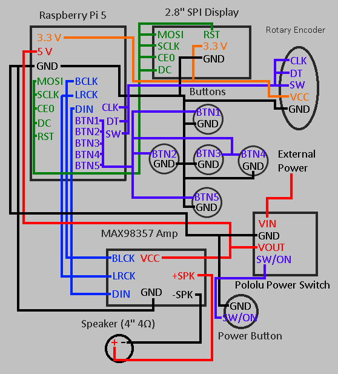

# Note-Block-Maestro

## What is this project?

This project is a physical note block player that uses a Raspberry Pi 5 to play and visualize Minecraft note block music. It can convert MIDI to note block songs, then either play back the song from a speaker or send it to a computer for use in-game.

## Why did I make this?

Minecraft note blocks have been a passion of mine for a long time, so when I first heard about Highway, it didn't take long to come up with this idea. I got to work on this almost immediately and am excited to be able to learn hardware skills and enhance my software skills with this project.

## How does it work?

The project is not done yet, far from it in fact. But once it is done, you transfer a `MIDI` or `.nbs` file from you computer to the Pi, choose to either export a vanilla safe version for in-game use, or to play it on the box's speakers. You can create and manage playlists from your web browser, then play the songs and playlists on the machine with the visualizer.

---

## Pictures

### 3D Model (work-in-progress)

### Wiring Diagram

---

## Bill of Materials

| Item                              | Link                                                                                                                                                                                 | Qty | Price  |
| --------------------------------- | ------------------------------------------------------------------------------------------------------------------------------------------------------------------------------------ | --- | ------ |
| Raspberry Pi 5 (4GB)              | [https://vilros.com/products/raspberry-pi-5?variant=40065551269982](https://vilros.com/products/raspberry-pi-5?variant=40065551269982)                                               | 1   | 60     |
| 64GB Samsung EVO+ microSD         | [https://vilros.com/products/copy-of-samsung-evo-micro-sd-card-preloaded-w-noobs](https://vilros.com/products/copy-of-samsung-evo-micro-sd-card-preloaded-w-noobs)                   | 1   | 10.99  |
| MicroSD to USB Adapter            | [https://vilros.com/products/micro-sd-to-usb-adapter](https://vilros.com/products/micro-sd-to-usb-adapter)                                                                           | 1   | 5      |
| MAX98357 I²S Mono Amp             | [https://www.amazon.com/MakerHawk-Amplifier-Amplifiers-Filterless-Raspberry/dp/B07PS653CD](https://www.amazon.com/MakerHawk-Amplifier-Amplifiers-Filterless-Raspberry/dp/B07PS653CD) | 1   | 6.99   |
| Dayton PC105-4 4″ Speaker         | [https://www.amazon.com/dp/B0751FHSV1](https://www.amazon.com/dp/B0751FHSV1)                                                                                                         | 1   | 20.72  |
| 2.8″ SPI Arducam TFT + 5MP Camera | [https://vilros.com/products/raspberry-pi-lcd-camera-module](https://vilros.com/products/raspberry-pi-lcd-camera-module)                                                             | 1   | 6.99   |
| 12mm Push Buttons (10-pack)       | [https://vilros.com/products/12mm-button-raspberry-pi](https://vilros.com/products/12mm-button-raspberry-pi)                                                                         | 1   | 6.99   |
| KY-040 Rotary Encoders (2-pack)   | [https://www.amazon.com/dp/B0D2TTG858](https://www.amazon.com/dp/B0D2TTG858)                                                                                                         | 1   | 6.99   |
| Dupont Jumper Wire Bundle         | [https://www.amazon.com/gp/product/B07GD2BWPY](https://www.amazon.com/gp/product/B07GD2BWPY)                                                                                         | 1   | 6.98   |
| M3 Nylon Standoffs/Screws Kit     | [https://www.amazon.com/gp/product/B0F32PK3ZQ](https://www.amazon.com/gp/product/B0F32PK3ZQ)                                                                                         | 1   | 6.76   |
| Soldering Kit                     | [https://www.amazon.com/gp/product/B087767KNW](https://www.amazon.com/gp/product/B087767KNW)                                                                                         | 1   | 12.99  |
| Pi 5 Active Cooler                | [https://vilros.com/products/raspberry-pi-5-active-cooler](https://vilros.com/products/raspberry-pi-5-active-cooler)                                                                 | 1   | 12     |
| 3D Printing Filament/cost         | local                                                                                                                                                                                | 1   | 10     |
| Pololu Power Switch               | [https://www.pololu.com/product/2810](https://www.pololu.com/product/2810)                                                                                                           | 1   | 9.90   |
| Estimated Subtotal                |                                                                                                                                                                                      |     | 183.30 |
| Estimated Sales Tax (7.5%)        |                                                                                                                                                                                      |     | 13.75  |
| Estimated Total                   |                                                                                                                                                                                      |     | 197.05 |
